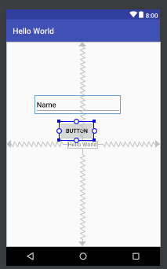

# Android Hello World

## Install Android Studio

Download installer from https://developer.android.com/studio/index.html

## Project Creation/Opening

Run Android Studio script and click on "Start a new Android project".

In next times, you will choose "Open an existing Android Studio project".

Define name of application (label, not apk file name), your domain and location of project in filesystem.

Define what API device you intend to deploy your app for.

Choose an Activity template (Activity is the presentation layer of Android).

Configure your Activity. It is a class, that has a name and a layout associated.

Android Studio will install components needed for choosen configuration.

After clicking on Finish button of previous window, Android Studio will build workspace of your project.

Project built from Empty Activity template will have a class `MainActivity` with a method `onCreate()`. This method overrides which is inherited from AppCompatActivity.

It's possible to run project and see something, clicking on button **Run** of toolbar.

It's two options to run Android applications: a connected device or a virtual device. Below we select a virtual device, previously created. Initially you don't have devices, then you need to click on **Create New Virtual Device** button for load the image of a emulator.

After clicking on button **Run**, the virtual device is started.

|||

Imediatelly, application is deployed.

And then, it is started. Below we see an application that has only a TextView. Phrase 'Hello World!' in the title bar is from application name. The same phrase in middle of windows is set in TextView component.

Inside folder `res` we find a subfolder `layout`. It contains file `activity_main.xml`. When we click on it, a windows with application layout is open, according image below. Inside this window you we can see a image of how Activity will be presented for user and a image with references for positioning of components.

## activity_main.xml

When we are working with layout, there is a window called `Component Tree`, that shows visual components of our application. For our example, there is only one, a TextView, set as "Hello World".

## Data input and output

Here we can learn how to handle with input and output with two components:

* Plain Text
* Button

Components can be selected from window `Palette` that can show all of them or only which belongs to same category. For addding a component to actitivy, it is enough to drag it and drop on activity view.

### Plain Text

### Button

## Defining position of components in device

We can define constraints of positioning for components, or they can be renderized ones upon others. We can stablish constraints clicking on border of component and determining a distance from other component.

One detail: remove component TextView.

## Controlling a event

Below we create a public method in class `MainActivity` calls `showTranslation`. This method changes content of Plain Text component.

This method will be run when user clicks on button. So, we connect this method to button setting attribute onClick, as seen below.

## Testing

After reload our application, clicking on **Run** button again, we will have a text box and a button, according image below.

If we click on button without to type something, the text box will show the default message.

But, if we types one of options or our list (inglês, alemão, espanhol, italiano)...

... text box will show something more specific - or only what was hoped.

Observation: for typing accents, we can configure languages in device.

